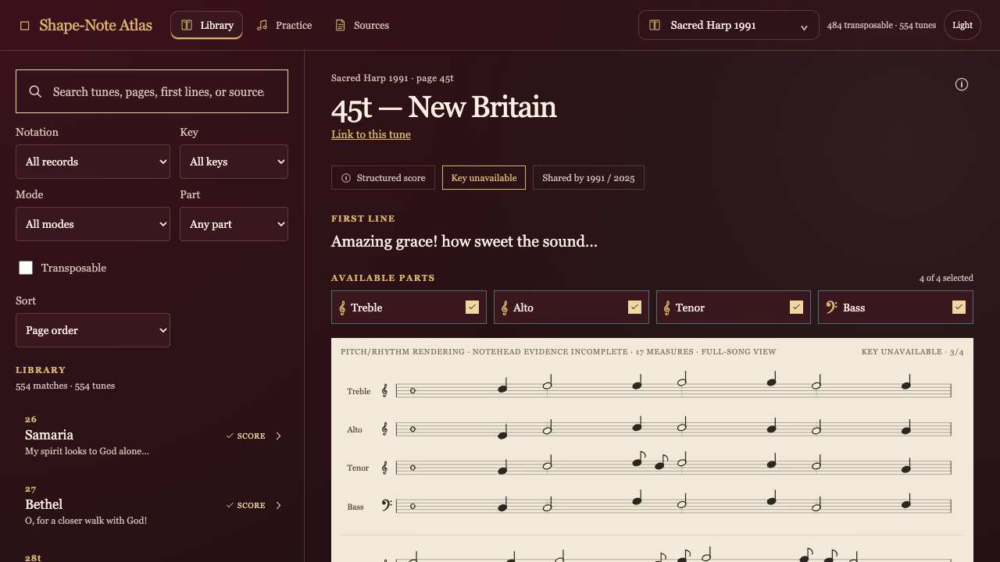

# The Shape-Note Atlas

**A searchable, source-faithful reader and practice space for shape-note and
Sacred Harp music.**

<p align="center">
  
</p>



The Atlas brings tune lookup, source links, structured MusicXML, four-shape
rendering, and browser playback into one small workspace. It keeps the whole
catalogue visible even when a tune does not yet have structured notation.

**Read the hosted [Atlas documentation](https://shapenote.jacquelinehenriksen.com/atlas/docs/)**
for the reader workflow, evidence states, and maintainer reference.

> **The governing rule:** a matching title is not proof of an edition match,
> and a playable draft is not a verified printed score.

## What you can do

- Search by tune number, title, first line, or source metadata.
- Browse eleven books/editions, with edition identity kept explicit.
- Filter by score availability, key, mode, vocal part, and transposability.
- Read complete structured scores as vertical four-measure systems.
- Practice selected parts with tempo, pause/resume, stop, and bounded loops.
- Follow encoded repeats when the source supports them; otherwise stay in
  written order.
- Transpose when the source key is established or explicitly entered.
- Open the source scan, PDF, recording, or MusicXML witness from the tune.
- Download and correct published review drafts without overwriting the source.

## The eleven books

The current corpus includes:

1. Sacred Harp 1991
2. Sacred Harp 2025
3. Cooper Book 2012
4. The Christian Harmony
5. The Shenandoah Harmony
6. The Southern Harmony
7. A Supplement to the Kentucky Harmony
8. The Social Harp
9. The Minnesota Harmony
10. Sacred Harp Tunes
11. The Trumpet

Coverage changes as generated data is refreshed. For current counts, read the
`generatedAt` and `coverage` fields in [`public/corpus.json`](public/corpus.json)
and [`public/source-coverage.json`](public/source-coverage.json), rather than
relying on a stale number in prose.

## Use the reader

### Find a tune

1. Choose an edition from **Tune book**.
2. Search for a page number, title, first line, or source.
3. Use the filters to narrow the list.
4. Select a result to open its detail pane.

The **Library**, **Practice**, and **Sources** views use the same catalogue.
The **Link to this tune** link preserves the selected book and tune in the URL,
so a specific record can be shared directly.

### Understand the labels

The Atlas keeps useful evidence visible without flattening it into one green
checkmark:

| Label | What it means |
| --- | --- |
| **Catalogued score** | Structured notation is attached to the selected edition. |
| **Alternate reference** | A score exists for another edition or source; it is labeled and never substituted. |
| **Review draft only** | A versioned transcription or OMR result is available for comparison and, where safe, practice. |
| **Source scan / source reference** | The source page, scan, or recording is available, but no admitted structured score is attached. |
| **Transcription blocked** | The next safe action is to acquire or resolve source evidence. |
| **Metadata only / source mapping gap** | The catalogue record exists without a usable structured-source path. |

These states answer different questions: *Is this the record? Is there
structured notation? Can I practice it? Has the exact printed edition been
reviewed?* The Atlas does not pretend those are the same question.

### Practice and transpose

For a structured score, select the parts you want, choose written order or an
encoded repeat plan, set a tempo from 40–220 BPM, and choose one to eight loops.
Playback stops when the selected parts, score version, source key, or target key
changes. A short score can also stop automatically at its actual end.

Transposition requires key evidence. If the source key is unknown, enter the
key printed on the linked source page. The entered key stays separate from
catalogue metadata; the Atlas never borrows a key from another edition just to
unlock a control.

The shape legend distinguishes:

- **Source** — the notehead shape is encoded by the witness.
- **Derived** — a four-shape label is calculated from an established key and
  exact pitch spelling.
- **Unavailable** — the source does not establish the shape or key.

The linked shape-source PDF remains the authority for printed glyphs. Missing
lyrics, shapes, mode, repeats, endings, or verse numbers stay visibly
unavailable instead of being guessed.

## What the Atlas is not

The Atlas is not a replacement for the printed book or its authoritative scan.
It is not a claim that every tune already has a complete exact-edition score.
Alternate-edition scores, OMR output, source recordings, and comparison PDFs
are valuable evidence and practice aids, but they do not close an edition's
mapping gap by themselves.

Published review drafts are deliberately human-correctable: download the
editable MusicXML, compare it with the untouched source, and use the linked
GitHub correction form when needed. Every draft carries a version, evidence,
hashes, and limitations. `safeToPromote` remains false until the required
source-review gate is satisfied.

## Run it locally

### Browser

```sh
npm ci --ignore-scripts --no-audit --no-fund
npm run dev
```

Open the local URL printed by Vite. The development server binds to
`127.0.0.1`.

For a production-like static preview:

```sh
npm run build
npm run preview
```

The committed `public/` bundle is enough to browse when you only need the
existing generated data. Regenerating that data requires the local source
checkout described below.

### macOS app

The SwiftUI wrapper bundles the browser build and a private local score-asset
service:

```sh
bash script/build_and_run.sh
```

The result is `outputs/The Shape-Note Atlas.app`. To run the package/startup
check without opening it:

```sh
bash script/build_and_run.sh --verify
```

The startup check does not prove native-window interaction or public
deployment.

## For maintainers

### Source-dependent data refresh

The corpus builder reads the established local source checkout:

```text
/Users/jacquelinehenriksen/sh-corpus-scripts
```

It expects the dashboard corpus, metadata export, edition-change register, and
local MusicXML cache. The builder refuses to create a partial bundle when its
required metadata inputs are missing.

After installing dependencies, the normal refresh path is:

```sh
python3 scripts/verify_dependencies.py
python3 scripts/fetch_shapenote_scores.py   # only when score mappings need refresh
npm run prepare-data
```

`prepare-data` rebuilds the corpus index and candidate reconciliation. Source
images, recordings, OMR, comparison PDFs, and review queues have separate
commands because each has a different evidence boundary. Do not run those
generators against missing or unverified inputs; read
[`docs/OPENCLAW_HANDOFF.md`](docs/OPENCLAW_HANDOFF.md) first.

### Generated data map

| File | Role |
| --- | --- |
| `public/corpus.json` | Application index, edition metadata, score previews, and lazy asset references. |
| `public/scores/` | Full structured score assets. |
| `public/draft-scores/` | Isolated review and published-draft assets. |
| `public/source-coverage.json` | Edition-scoped coverage state and next safe action. |
| `public/transcription-queue.json` | Records without an exact structured score. |
| `public/human-review-queue.json` | Drafts, dispositions, evidence, and correction metadata. |
| `public/image-review-queue.json` | Immutable source images and review-only working layers. |
| `public/source-comparison-ledger.json` | Source-versus-candidate comparisons; never automatic promotion. |
| `public/shared-edition-reconciliation.json` | Explicit relationships and differences between editions. |
| `public/source-health.json` | Network/evidence/retention observations with offline and cached states preserved. |
| `public/shapenote-score-manifest.json` | Hash-checked mappings from the Shape Note Music Files index. |

The `work/` tree contains retained sources, downloaded inputs, OMR output, and
verification receipts. Much of it is intentionally local-only or ignored. A
Git clone alone is not a complete source-dependent validation environment.

### Verification

Run focused validators after changing the corresponding layer:

```sh
python3 scripts/validate_data.py
python3 scripts/validate_playback.py
python3 scripts/validate_transposition.py
```

Then run the fail-closed aggregate check:

```sh
npm run verify-all
```

It checks generated-artifact integrity, stale inputs, unsafe mode defaults,
promotion safety, queue consistency, data, playback, transposition, shape and
image review, source candidates, source health, browser smoke when available,
the production build, and startup.

Useful bounded options:

```sh
npm run verify-all -- --no-build
npm run verify-all -- --no-write
npm run verify-all -- --skip-source-health-collection
npm run verify-all -- --allow-missing-optional
npm run verify-all -- --source-health-online --source-health-max-urls 25
```

Online source-health checks require an explicit positive URL cap. Offline mode
validates the existing report without claiming a fresh network sweep. Receipts
are written to `work/verification/` unless `--no-write` is used.

For browser-level audio proof, run `npm run dev` and open
[`/audio-harness.html`](http://127.0.0.1:5173/audio-harness.html). Follow the
[browser smoke plan](scripts/browser-smoke-test-plan.md) and capture a fresh
receipt for the tested commit. Do not relabel an older receipt after changing
the application.

### Contribution guardrails

- Start with `git status`; preserve unrelated work and cloud-backed duplicates.
- Verify the intended edition and source hashes before transcribing.
- Compare actual exported MusicXML, not only a sidecar JSON report.
- Preserve pitch, timing, parts, clefs, voice/staff, ties, repeats, endings,
  lyrics, and notehead geometry when the source establishes them.
- Keep source notehead evidence separate from pitch-derived shape labels.
- Leave unsupported semantics unavailable; do not fill them with plausible text.
- Issue a new version for every correction and retain superseded artifacts.
- Keep `safeToPromote: false` until direct source review authorizes promotion.
- Stage only the reviewed batch.
- Report source review, focused tests, browser proof, build state, and
  deployment separately.

## Documentation map

- **[Atlas guide](docs/ATLAS_GUIDE.md)** — reader workflow, data model, and
  maintainer procedures.
- **[OpenClaw handoff](docs/OPENCLAW_HANDOFF.md)** — current continuation state,
  retained evidence, active source lanes, and non-negotiable rules.
- **[Program status](docs/OPENCLAW_PROGRAM_STATUS.md)** — dated progress notes
  and historical verification receipts.
- **[Browser smoke plan](scripts/browser-smoke-test-plan.md)** — required audio
  and interaction cases.

The Atlas is intentionally skeptical of convenient certainty. That is how a
tune catalogue stays useful instead of becoming a polished set of guesses.
