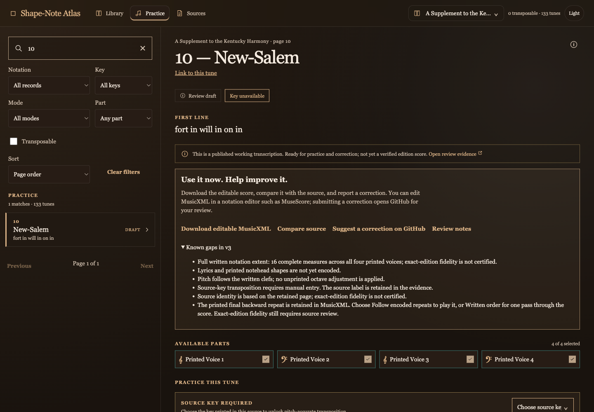
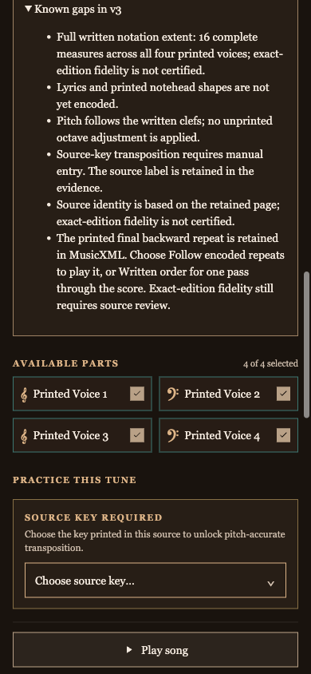

# Shape-Note Atlas review — September 18, 2026

The application is functioning and passes its current required checks. The largest remaining work is source-backed notation and editorial review across eleven books. The continuation document had fallen behind the implementation and was directing agents toward completed tasks; it is now corrected.

## Changes delivered

- Reconciled the main handoff and program status with the actual repository history. All 221 existing Social Harp catalogue records already have reviewed page identities; Afton v27 and the A Glimpse of Thee opening are already published. The current publication count is 18.
- Corrected New Salem's misleading claim that repeat playback was unavailable. Its known-gaps panel now explains how to choose Follow encoded repeats or Written order. The manifest and all six generated occurrences agree.
- Verified that the only data change was this exact explanatory sentence, plus the dependent corpus fingerprint. Every score event, MusicXML candidate, source asset, and shared-edition comparison is preserved.
- Built the missing local macOS package and captured a fresh browser receipt, resolving the two prerequisites that initially blocked the aggregate check.

Commits: `39cff5b` (handoff correction), `3fbfeef` (New Salem repeat description). Both pushed to `origin/main`; remote head and clean checkout verified. No live deployment verification is claimed.

## Current coverage

3,547 songs, 4,202 book appearances, 1,155 structured score mappings, 3,047 missing mappings, 13 SH2025 correction records, and 18 pinned practice publications. Validation accepts 138 review draft assets. A structured mapping is not certification of exact printed-edition fidelity.

| Book | Appearances | Structured mappings | Missing mappings |
| --- | ---: | ---: | ---: |
| Sacred Harp 1991 | 554 | 552 | 2 |
| Sacred Harp 2025 | 590 | 13 | 577 |
| Cooper Book 2012 | 613 | 517 | 96 |
| The Christian Harmony | 669 | 3 | 666 |
| The Shenandoah Harmony | 468 | 0 | 468 |
| The Southern Harmony | 335 | 70 | 265 |
| A Supplement to the Kentucky Harmony | 133 | 0 | 133 |
| The Social Harp | 221 | 0 | 221 |
| The Minnesota Harmony | 87 | 0 | 87 |
| Sacred Harp Tunes | 427 | 0 | 427 |
| The Trumpet | 105 | 0 | 105 |

## What needs doing next

1. **Extend useful partial scores:** A Glimpse of Thee from measure 5; Zion's Dove after its currently transcribed second-system segment. Preserve each prior version and its exact XML prefix.
2. **Complete source-grounded lyric and shape work:** Afton v27's remaining underlay, Devotion and Portsmouth lyrics, and New Salem / Something New lyrics and noteheads. Afton's P3 m12 `dis` correction is already done.
3. **Turn resolved page identities into practice drafts:** Social Harp and Trumpet have source identities but no exact structured score mappings. Page mapping is no longer the Social Harp bottleneck.
4. **Repair catalogue text from direct evidence:** New Salem's current first line reads `fort in will in on in`. Reconcile it against the printed lyric and the upstream text source; do not guess a replacement from a familiar tune title. Separately resolve Social Harp's historical 221/222 count, Glimpse's printed L.M.D. versus catalogue L.M., and the historical Trumpet prose records.
5. **Acquire exact edition witnesses:** Southern Harmony page 12 still needs an identifiable printed witness; the retained derivative engraving is insufficient. SH1991/322, /80b and Cooper/116 have dated source-access gaps.
6. **Verify release surfaces separately:** this pass verifies the local browser and package/static-preview startup. Native-window interaction and the live hosted deployment remain unverified.

## Validation and rendered QA

Environment: local Vite 7.3.6, React / React DOM 19.2.8, real Chromium via Playwright CLI. Browser plugin not available; used the installed Playwright workflow. Reader: `http://127.0.0.1:5173/`; audio instrumentation: `/audio-harness.html`.

**All 20 required aggregate checks passed at `3fbfeeffe0d36423525d1910b2ea0e2e29b26c27`.** The source-health report was validated offline; no new network reachability sweep is implied. Separate focused checks passed: 12 reproducibility tests, nine publication tests, 30 practice/key/discovery/notehead tests. All 1,546 known retained-source prerequisites are present.

| Browser check | Result |
| --- | --- |
| Page identity and meaningful content | Pass: The Shape-Note Atlas and rendered New-Salem score |
| Framework error overlay | None |
| Console health | No errors or warnings |
| Major/minor transposition and explicit unknown-key entry | Pass: observed frequencies match source data and target intervals |
| Alternate reference and playable review draft | Pass |
| Partial voices, target-change cancellation, tune-change key reset | Pass |
| Automatic completion | Pass: Play returns and all scheduled oscillators stop |
| New Salem written order / encoded repeat | 167 / 334 scheduled notes; pause, resume and stop pass |
| Updated limitation visible | Pass |
| Desktop 1440×1000 / mobile 390×844 | No page-level horizontal overflow on the checked page |

The audio harness measures browser Web Audio scheduling and cleanup; it does not claim a human listening assessment. No notation or edition was newly certified.

Evidence: [aggregate receipt](verification.json), [aggregate readable results](verification.md), [browser receipt](browser-receipt.json), [visual checks](visual-check.json).

Reproduce from the established repository with the existing package build script, a fresh browser receipt, and `scripts/verify_all.py --skip-source-health-collection --browser-receipt PATH`. The receipt validates the tested commit and relevant file hashes; do not relabel it after edits.

## Screenshots

Desktop shows the corrected known-gaps panel; mobile shows it wrapped without horizontal overflow.

